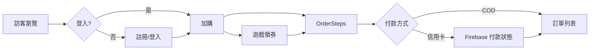
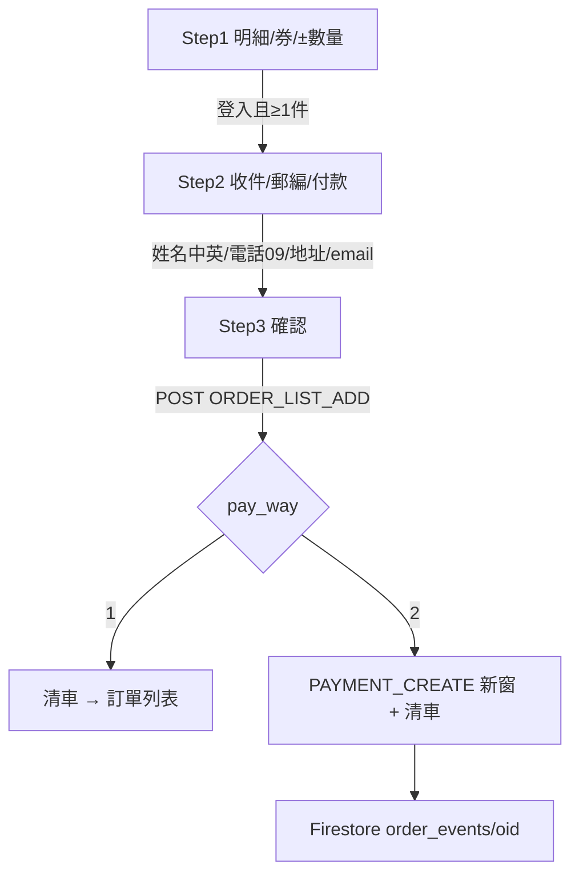
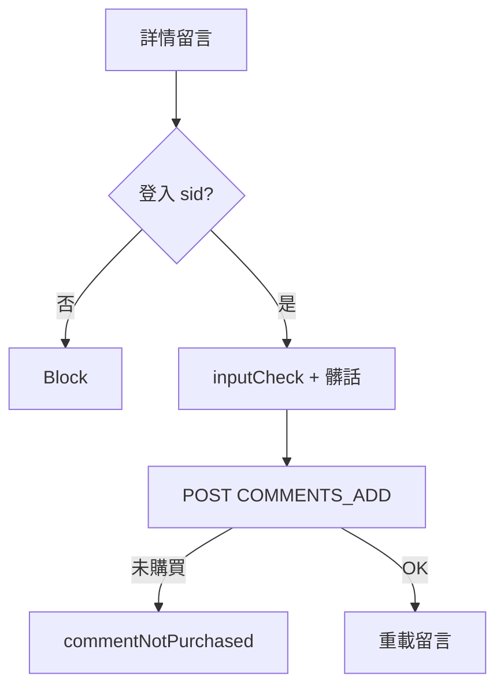

# PetPet Shop（佩佩星球）前端 PRD

| 項目 | 內容 |
|------|------|
| 產品名稱 | PetPet Shop / 佩佩星球 |
| 文件版本 | 1.0 |
| 範圍 | 前端（本 repo）
| 技術棧 | Next.js 14、React 18、Redux Toolkit + persist、Context、Bootstrap 5、react-intl、Firebase、Jest |

---

## 1. 產品概述

寵物用品模擬電商。訪客可瀏覽／搜尋商品；登入後可加購、結帳、領券、查訂單、留言。雙語：`zh-TW` / `en-US`。

### 1.1 目標使用者

| 角色 | 能力 |
|------|------|
| 訪客 | 首頁、列表、詳情、語系切換 |
| 會員 | 加購、結帳、訂單、優惠券、遊戲領券、個人資料、商品留言 |
| 系統 | JWT 驗證、訂單成立、信用卡付款狀態（Firestore） |

### 1.2 非目標（現況）

- 後台管理、完整 Category 獨立頁（Header 分類皆導向同一 list）
- 購物車雙狀態統一（見 §8）

---

## 2. 功能需求

### 2.1 商品

| ID | 需求 | 路由／實作 |
|----|------|------------|
| P-01 | 首頁推薦商品 + CTA | `/` → `app/page.tsx` |
| P-02 | 列表：搜尋、價區、分類 tag、排序、分頁 | `/product/list` |
| P-03 | 詳情 SSR：輪播、雙語、庫存、加購／立即結帳 | `/product/[pid]` |
| P-04 | 商品留言（需登入；已購買才可留；髒話／安全過濾） | 詳情頁 |

**列表規則**

- Query：`page`、`searchWord`、`priceLow`、`priceHigh`、`sortBy`、`tag`；Header `Accept-Language`
- 關鍵字長度 &lt; 2 不搜；條件變更回第 1 頁
- Tag id 5–13：乾糧、罐頭、保健、衣服、美容、玩具、生活、牽繩、背包
- 價區：全部／1–499／500–999／1000–1999／2000–2999
- 排序：cheap／expensive／預設 pid 降序

### 2.2 會員

| ID | 需求 | 路由 |
|----|------|------|
| M-01 | 登入（account / password）→ `localStorage.auther` | `/member/login` |
| M-02 | 註冊兩步（個資 → 地址＋頭像 FormData） | `/member/register-all` |
| M-03 | 會員中心（JWT exp；401 → login） | `/member` |
| M-04 | 編輯會籍兩步 | `/member/edit-process` |
| M-05 | 訂單列表（分頁） | `/member/member-orderList` |
| M-06 | 登出清空 `auther` → `/` | Header |

### 2.3 購物車與結帳

| ID | 需求 | 說明 |
|----|------|------|
| C-01 | 加購同 `pid` 累加 quantity | Redux `addItem` |
| C-02 | ± 數量；decrement 下限 1；remove 刪列 | Redux / Context |
| C-03 | 運費固定 NT$30；總額 = Σ(price×qty) + 30 | selectors / list |
| C-04 | 優惠券：status 0 可用／1 已用／2 過期；減額或比例；券後若 cartTotal≤30 → netTotal=0 | Step1 |
| C-05 | 三步結帳 | `/cart/OrderSteps` |
| C-06 | 成立訂單後依 `pay_way` 分支 | 見流程圖 |
| C-07 | 訂單詳情 | `/cart/[oid]`（需 JWT） |

**加購／結帳前置條件：** 須有 `auther.sid`（未登入 toast／擋下）。

### 2.4 付款

| pay_way | 行為 |
|---------|------|
| `1` 貨到付款 | Toast → `/member/member-orderList`；清車 |
| `2` 信用卡 | `PAYMENT_CREATE/{oid}` 回傳 HTML 新開窗；`sessionStorage.last_oid`；Firebase 監聽 `/cart/OrderSteps/paymentStatus` |

### 2.5 優惠與遊戲

| ID | 需求 | 路由 |
|----|------|------|
| F-01 | 小遊戲領券（折扣 30 或 50；hash 8 碼；expiry +30 天） | `/favorite/game` |
| F-02 | 優惠券紀錄 | `/favorite/couponHistory` |
| F-03 | `/favorite` 主頁標為棄用 | — |

### 2.6 其他

| ID | 需求 |
|----|------|
| X-01 | Header／Footer；語系切換；加購 Header 動畫 |
| X-02 | 404／500 |
| X-03 | 台灣縣市鄉鎮郵遞區號元件（結帳／會員地址） |

---

## 3. 資訊架構與路由

```
/                          首頁（App Router）
/product/list              商品列表
/product/[pid]             商品詳情（App SSR）
/cart                      簡易購物車
/cart/OrderSteps           結帳 Step1–3
/cart/OrderSteps/paymentStatus  付款結果
/cart/[oid]                訂單詳情
/member/login|register-all|edit-process|member-orderList|…
/favorite/game|couponHistory
```

---

## 4. 流程

### 4.1 整體使用者旅程



### 4.2 登入／註冊

```mermaid
flowchart TD
  A[/member/login] -->|POST LOGIN| B[存 auther]
  B --> C[/member]
  D[註冊 Step1 個資] --> E[Step2 地址+頭像]
  E -->|POST REGISTER_ADD multipart| F[完成→可登入]
```

### 4.3 商品瀏覽 → 加購

```mermaid
flowchart TD
  H[首頁推薦 /product/list] --> D[/product/pid]
  D --> Auth{已登入?}
  Auth -->|否| Login[導向登入]
  Auth -->|是| Add[dispatch addItem → persist:cart]
  Add --> Header[Header 數量更新]
  Add --> BuyNow[立即結帳 → OrderSteps]
```

### 4.4 結帳三步



**訂單 payload 欄位：** `sid`、收件中英名、`phone`、`email`、`address`、`postcode`、`pay_way`、`pid[]`、`sale_price[]`、`actual_amount[]`、`coupon_id`、`discount_coins`。

### 4.5 留言



### 4.6 遊戲領券

```mermaid
flowchart TD
  G[/favorite/game] --> Play[完成遊戲]
  Play --> Hash[產生券碼]
  Play --> API1[COUPON_ADD]
  API1 --> API2[COUPON_USE_ADD 綁會員]
  API2 --> Hist[/favorite/couponHistory]
```

---

## 5. 狀態與資料

### 5.1 前端狀態

| 來源 | Key／內容 | 使用處 |
|------|-----------|--------|
| Redux persist | `persist:cart` → `{ items }` | 加購、Header 數、cart list |
| Context Cart | `localStorage.cart` | OrderSteps／部分 cart 頁 |
| Auth | `localStorage.auther` = `{ sid, account, token }` | 全站登入態 |
| Language | zh-TW / en-US | react-intl |
| Game / HeaderAnimation | Context | 主題、加購動畫 |

### 5.2 主要 API（`components/my-const.js`）

| 常數 | 用途 |
|------|------|
| `PRODUCT` / `PRODUCT_RECOMMEND` / `ONE_PRODUCT` | 列表／推薦／單品 |
| `ORDER_LIST_ADD` / `PAYMENT_CREATE` / `ORDER_LIST` / `ONE_ORDER` | 下單／付款／訂單 |
| `LOGIN` / `REGISTER_ADD` / `GET_MEMBER_DATA` / `PUT_MEMBER_DATA` / `CHECK` | 會員 |
| `COMMENTS_ONE` / `COMMENTS_ADD` | 評論 |
| `COUPON_ADD` / `COUPON_USE_ADD` / `GET_COUPON_DATA` | 優惠券 |

外部：Firebase Firestore `order_events/{oid}`（`status: success|fail`）。

---

## 6. 業務規則摘要

1. 同 `pid`（字串比對）合併數量，不新增列  
2. 數量下限 1；運費 30  
3. 加購／結帳／留言需登入  
4. 收件：中文姓名與地址；手機 `09xxxxxxxx`；email regex  
5. 券後總額 ≤ 運費時顯示淨額 0  
6. Bearer Token 用於會員／訂單相關請求  

---

## 7. 驗收標準（核心）

| 場景 | 通過條件 |
|------|----------|
| 訪客列表／詳情 | 可搜尋、篩選、開詳情；未登入無法加購 |
| 註冊→登入 | 資料持久；Header 顯示會員與車數 |
| 加購→COD | 三步通過；訂單列表可見；購物車清空 |
| 加購→信用卡 | 新窗付款頁；paymentStatus 可反映 success/fail |
| 領券→結帳套用 | 金額正確折抵 |
| 留言 | 未購失敗；已購成功；髒話擋下 |
| i18n | 切語系後文案與列表 Accept-Language 正確 |

---

## 8. 已知風險／技術債

1. **雙購物車**：Redux `persist:cart` 與 Context `cart` 並存；結帳 `clearCart` 可能只清 Context  
2. Header 分類未帶獨立 category query  
3. `configs/index.js`（3005）與主 API（3002）不一致  
4. Firebase 設定寫死於前端  
5. `paymentStatus` 與 listener 狀態欄位對齊不完整  

---

## 9. 核心檔案索引

| 領域 | 路徑 |
|------|------|
| API 常數 | `components/my-const.js` |
| Cart 純函式 | `components/hooks/cart-reducer-state.ts` |
| Redux | `slice/cartSlice.js`、`utils/store.js` |
| 結帳 | `pages/cart/OrderSteps/` |
| 列表／詳情 | `pages/product/list.js`、`app/product/[pid]/` |
| Auth | `components/contexts/AuthContext.js` |
| Firebase | `utils/firebase.js` |
